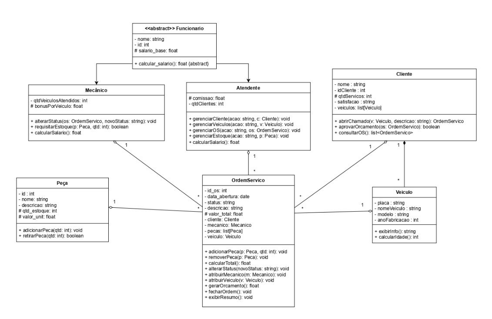

# Sistema de Mecânica - Programação Orientada a Objetos

Este projeto implementa um sistema de mecânica completo em Python, aplicando todos os conceitos fundamentais da Programação Orientada a Objetos (POO) conforme especificado no diagrama UML fornecido. 

## 📐 Diagrama UML
O diagrama UML abaixo representa a estrutura do sistema de mecânica, destacando todas as classes, seus atributos, métodos e relacionamentos definidos no projeto. 

Ele serve como uma visão geral da arquitetura orientada a objetos, que permite compreender:
- As principais entidades do sistema
- As relações entre classes (herança, composição, associação)
- O fluxo da aplicação baseado em objetos. 



(Para melhor visualização, acessar a pasta images e acessar o pdf do diagrama)

## 📁 Estrutura do Projeto

```
Mecanica/
├── models/          # Classes do modelo 
    ├── Cliente.py
    ├── Funcionario.py
    ├── OrdemServico.py
    ├── Peca.py
    ├── Veiculo.py
├── main.py            # Demonstração completa do sistema
├── regras.py          # Testes unitários e de integração
└── README.md          # Documentação do projeto
```

## 🔧 Conceitos de POO Implementados

### 1. **Herança e Abstração**
- **Classe abstrata**: `Funcionario` (usando `abc.ABC`)
- **Herança**: `Mecanico` e `Atendente` herdam de `Funcionario`
- **Método abstrato**: `calcular_salario()` com `@abstractmethod`

```python
class Funcionario(ABC):
    @abstractmethod
    def calcular_salario(self) -> float:
        pass

class Mecanico(Funcionario):
    def calcular_salario(self) -> float:
        return self._salario_base + (self._qtd_veiculos_atendidos * self._bonus_por_veiculo)
```

### 2. **Polimorfismo**
- Implementação específica de `calcular_salario()` em cada classe filha
- Comportamentos distintos para mecânicos (bônus por veículo) e atendentes (comissão por cliente)

### 3. **Encapsulamento**
- **Atributos privados**: Uso de `_` para indicar atributos protegidos
- **Properties**: Uso do decorador `@property` para controle de acesso
- **Validações**: Setters com validação de dados

```python
@property
def nome(self) -> str:
    return self._nome

@nome.setter
def nome(self, valor: str):
    if not valor or not isinstance(valor, str):
        raise ValueError("Nome deve ser uma string não vazia")
    self._nome = valor
```

### 4. **Relacionamentos**
- **Agregação**: Cliente possui Veículos (cliente pode existir sem veículos)
- **Composição**: OrdemServico contém Peças (peças fazem parte da OS)
- **Associação**: OrdemServico se relaciona com Cliente, Mecanico e Veiculo


## 🚀 Como Executar

### Pré-requisitos
- Python 3.6 ou superior

### Execução
1. **Demonstração completa**:
```bash
python main.py
```

2. **Executar testes**:
```bash
python regras.py
```

## ⚙️ Funcionalidades

### Gestão de Funcionários
- Cadastro de mecânicos e atendentes
- Cálculo automático de salários com bônus/comissões
- Relatório de folha de pagamento

### Gestão de Clientes e Veículos
- Cadastro de clientes com validações
- Associação de múltiplos veículos por cliente
- Controle de satisfação do cliente

### Controle de Estoque
- Cadastro de peças com validações
- Controle de entrada e saída
- Alertas de estoque baixo

### Ordens de Serviço
- Criação e acompanhamento de OS
- Atribuição de mecânicos
- Cálculo automático de valores
- Controle de status (Aberto → Em Andamento → Concluído)

### Relatórios
- Folha de pagamento detalhada
- Relatórios por período
- Análise de produtividade
- Controle de satisfação

## 💻 Exemplos de Uso

### Criando Funcionários
```python
# Mecânico com bônus por veículo
mecanico = Mecanico("João Silva", 1, 3000.00, 0, 150.00)

# Atendente com comissão por cliente
atendente = Atendente("Ana Costa", 2, 2500.00, 50.00, 0)
```

### Criando Ordem de Serviço
```python
sistema = SistemaMecanica()

# Cadastrar entidades
sistema.cadastrar_funcionario(mecanico)
sistema.cadastrar_cliente(cliente)
sistema.cadastrar_veiculo(veiculo, cliente.id_cliente)

# Criar OS
os = sistema.criar_ordem_servico(
    cliente.id_cliente, 
    veiculo.placa, 
    "Troca de óleo e filtros"
)

# Atribuir mecânico e adicionar peças
sistema.atribuir_mecanico_os(os.id_os, mecanico.id)
sistema.adicionar_peca_os(os.id_os, peca.id, 2)

# Finalizar serviço
sistema.finalizar_os(os.id_os)
```

## 🧪 Testes

O sistema inclui uma bateria completa de testes:

### Testes Automatizados
- Testes unitários para todas as classes
- Validação de herança e polimorfismo
- Testes de encapsulamento e properties
- Validação de regras de negócio

### Testes Manuais de Integração
- Fluxo completo de atendimento
- Validações de negócio
- Cálculos e relatórios

### Executar Testes
```bash
python regras.py
```

## 🏗️ Arquitetura

### Camadas da Aplicação

1. **Modelos**
   - Definição das classes principais separadas em diferentes arquivos
   - Regras básicas de validação
   - Relacionamentos entre entidades

2. **Serviços (`servicos.py`)**
   - Lógicas de negócio complexas
   - Operações CRUD
   - Validações avançadas
   - Geração de relatórios

3. **Apresentação (`main.py`)**
   - Interface do usuário (console)
   - Demonstrações do sistema
   - Fluxos de uso

4. **Testes (`regras.py`)**
   - Validação de funcionalidades
   - Testes de integração
   - Cenários de erro

## 📊 Demonstrações

O arquivo `main.py` inclui demonstrações completas de:

1. **Herança e Polimorfismo**: Cálculo diferenciado de salários
2. **Encapsulamento**: Validações com properties
3. **Agregação e Composição**: Relacionamentos entre objetos
4. **Sistema Completo**: Fluxo end-to-end

## ✅ Regras de Negócio

### Funcionários
- Nome não pode ser vazio
- ID deve ser único e positivo
- Salário base deve ser positivo
- Validação de tipos de dados

### Clientes
- Não é permitido nome vazio
- Satisfação deve estar na lista de valores válidos

### Veículos
- Placa com formato válido (mínimo 7 caracteres)
- Ano de fabricação entre 1900 e ano atual + 1
- Nome do veículo obrigatório

### Peças
- Valor unitário positivo
- Quantidade em estoque não negativa
- Nome obrigatório

### Ordens de Serviço
- Status deve estar na lista válida
- Cliente e veículo devem existir
- Mecânico deve ser do tipo correto

## 🎉 Resultados

### Execução da Demonstração
- ✅ Sistema executa sem erros
- ✅ Todas as funcionalidades principais demonstradas corretamente
- ✅ Cálculos corretos (folha, orçamentos, etc.)
- ✅ Relatórios gerados com sucesso
- ✅ Interações entre classes funcionando de acordo com o diagrama UML

### Testes
- ✅ **Testes automatizados aprovados**
- ✅ **Testes manuais concluídos com sucesso**
- ✅ **Validação das regras de negócio e comportamentos esperados**

## 📝 Conclusão

Este projeto demonstra a aplicação completa e integrada com principais pilares da Programação Orientada a Objetos (POO) em Python, seguindo fielmente o diagrama UML do sistema:

- **Herança**: Reutilização de código através da hierarquia Funcionario
- **Polimorfismo**: Comportamentos específicos em métodos comuns
- **Abstração**: Classes abstratas definindo contratos
- **Encapsulamento**: Dados protegidos através de atributos privados e validações robustas
- **Relacionamentos**: Agregação, composição e associação implementadas
- **Modularidade**: Código organizado em módulos separados, facilitando manutenção e expansão
- **Validações**: Regras de negócio bem definidas asseguram integridade e confiabilidade dos dados
- **Testes**: Conjunto completo de testes garantindo estabilidade e funcionamento correto do sistema

O sistema está pronto para uso e expansão, seguindo as melhores práticas de desenvolvimento orientado a objetos.

## 🫂 Desenvolvedores
- **André Luiz Vicenzi Rigo**
- **Kauan Lucas Toldo**
- **William Kunzler**
- **Yasmin Maria Zerbielli**